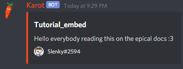
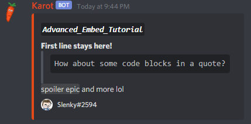

# Embed generation

\[p\] = Your prefix, not "\[p\]"! This is `+` by default.  
\[c\] = The color of the embed  
\[t\] = The one word title \(e.g. A\_Title\)  
\[d\] = The description/content of the embed, this can be more than 1 word.  
You may also mention the bot to get it to function.


To generate embeds with Karot, **you** will need the `MANAGE_MESSAGES` permission.  
Please also ensure **the bot** has the `EMBED_LINKS` permission.


## Creating a simple embed

Creating a simple embed is pretty easy, the more **advanced part is the formatting** of the embeds, we'll cover that later!  
  
You may also use colors \[c\], **Colors are case sensitive!**  
  
Some of the colors \[c\] you can use are:   
  
`DEFAULT`, `AQUA`, `DARK_AQUA`, `GREEN`, `DARK_GREEN`, `BLUE`, `DARK_BLUE`, `PURPLE`, `DARK_PURPLE`, `LUMINOUS_VIVID_PINK`, `DARK_VIVID_PINK`, `GOLD`, `DARK_GOLD`, `ORANGE`, `DARK_ORANGE`, `RED`, `DARK_RED`, `GREY`, `DARK_GREY`, `DARKER_GREY`, `LIGHT_GREY`, `NAVY`, `DARK_NAVY`, `YELLOW`, `WHITE`, `BLURPLE`, `GREYPLE`

```javascript
$ [p]embed [c] [t] [d]
```


 You may also use a custom hex color


The resulting embed should look a bit like this:





The bot will delete your message upon sending the embed if it has the `MANAGE_MESSAGES` permission, this is to help you keep your server clean. Please ensure you either have the embed command copied or disable the bot's `MANAGE_MESSAGES` permission if you do not wish for this to occur.


## Creating an advanced embed


The command and the basics stay the same, this section will just describe the MD formatting you can use more!


Karot's embed generation fully supports Discord's Markdown text formatting so making neat embeds shouldn't be difficult.  
If you are unfamiliar with how Discord's text formatting works, check [this ](https://support.discord.com/hc/en-us/articles/210298617-Markdown-Text-101-Chat-Formatting-Bold-Italic-Underline-)out first.  
  
The command should look a bit more like this, with line breaks being made with the combination of   
**Shift + Enter**, in this example I'll be using a custom hex color, which of course you may change to either one of the simple color names you saw earlier or a different hex color, it's up to you really!

```javascript
[p]embed #E54918 *`Advanced_Embed_Tutorial`* **First line stays here!**
> ```How about some code blocks in a quote?```
||spoiler epic|| and more lol 
```

The resulting embed should look a bit like this\(or however else you make it look\):



